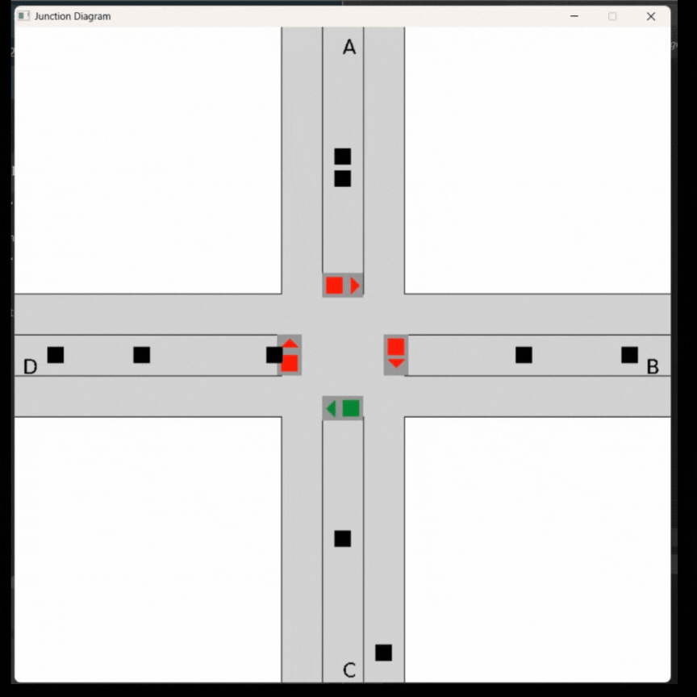

# dsa-queue-simulator
1st assigment of 2nd Year 1st Sem

Traffic Simulation Project
This project simulates traffic flow at a four-way intersection with traffic lights and multiple lanes. The simulation demonstrates vehicle movement, lane changing, and traffic light management for optimal traffic flow.

## Features

-Four-way intersection with traffic lights
-Multiple lanes per road:

    -Lane 1: Exit lane (vehicles moving away from  intersection)
    -Lane 2: Through lane (controlled by traffic light)
    -Lane 3: Free-flow lane (no traffic light control)

-Dynamic vehicle movement and collision avoidance
=Traffic light timing system
-Queue-based vehicle management
-Real-time visualization using SDL2

## Prerequisites:
Before running this project, make sure you have the following installed:

-SDL2 Library
-C Compiler (GCC recommended)

To Build :
First complie the receiver2.c: gcc receiver2.c -o receiver2.exe -lws2_32  
Then compile traffic_generator.c: gcc -o traffic_generator.exe traffic_generator.c -lws2_32
Run both of them and compile simulator.c: gcc simulator.c queue.c -o simulator -lSDL2 -lSDL2_ttf

Run the simulation.

## DEMO

## ALGORITHM
Traffic Light Control:

Traffic lights change based on queue sizes and priority rules.

If a road has more than 10 vehicles in Lane 1, it gets priority.

Vehicle Movement:

Vehicles in Lane 0 are dequeued after 3 seconds.

Vehicles in Lane 1 move only when the traffic light is green.

Vehicles in Lane 2 move without waiting for the traffic light.

File Parsing:

The vehicles.data file is read line by line, and vehicles are enqueued to their respective lanes.

## DATA STRUCTURES:
VehicleQueue: A queue data structure to manage vehicles in each lane.

SharedData: A structure to share data between threads (e.g., traffic light state).

Multithreading
Thread 1: Handles traffic light control (chequeQueue).

Thread 2: Handles file parsing and enqueuing vehicles (readAndParseFile).

Main Thread: Handles rendering and vehicle movement.

## References:
SDL2 Documentation: https://wiki.libsdl.org/SDL2/FrontPage
SDL2_ttf Documentation:https://github.com/libsdl-org/SDL_ttf

